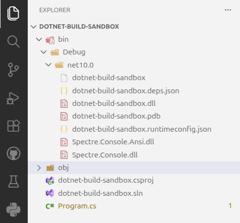

# Adding a Package

## What is a Package?

A **package** is a collection of code that is published to a repository and can be used by other projects.

Most projects are not written in one big project, but rather contain several packages. This may include any mix of our own code and third-party code from external sources.

A **package manager** is a tool that is used to install, update, and remove packages. In .NET, the package manager is called **NuGet**.

## Adding a Package to a Project

For this application we want to print colored output to the console. There is no functionality built into the .NET base class library to do this, so we will add the **Spectre.Console** package to do this. This allows us to use someone else's code within our project.

From your terminal run the following command:

```bash
dotnet add package Spectre.Console
```

Copy and paste the following code into the `Program.cs` file. You can use the Copy button in the top right corner of the code block to copy the code to your clipboard:

```csharp linenums="1"
using Spectre.Console;

// Get user input for color
Console.Write("Enter a hex color (e.g. FF5733): ");
string hex = Console.ReadLine();

// Display the chosen color using a function from the Spectre.Console library
AnsiConsole.Markup($"You chose the color [#{hex}]#{hex}[/]\n");
```

<!-- prettier-ignore -->
!!! note "IDE Warnings"
    Do not worry if you see green squiggles under the `Console.Readline()` line in your IDE. We will address this issue later.

Then build the project:

```bash
dotnet build
```

Open your `bin/Debug/net10.0` directory and you will see the new package dll's for the Specture.Console library have been added to the `bin` directory.



Give the program a try - you should see colored output when you enter a valid six character hex color code!
