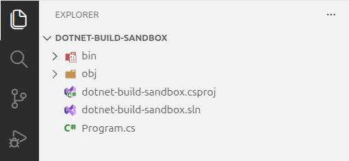

# Build Artifacts

Our explorer pane should now look like this:

## Understanding the Build Output Directories

We now have two new directories.

| Directory | Description                                                                                                                                                                  |
| --------- | ---------------------------------------------------------------------------------------------------------------------------------------------------------------------------- |
| **bin**   | Contains the final output of compilation. This is what we will use to run the application.                                                                                   |
| **obj**   | An intermediate working directory for the build system. Contains downloaded NuGet packages, generated code, and partially-compiled artifacts. Not meant to be used directly. |

## Understanding the Build File Types

Let's look at two significant file types that were created.

| File Type | Description                                                                                                                                                                  |
| --------- | ---------------------------------------------------------------------------------------------------------------------------------------------------------------------------- |
| **.dll**  | These are **assemblies**. One assembly is created per project. Assemblies may either be the executable itself, or a supporting library that is referenced by the executable. |
| **.pdb**  | These files contain **debug symbols** that the debugger uses to map the compiled code to the source code.                                                                    |

The `dotnet build` command creates a version of the application that is suitable for development use, but does not include the final artifacts that will be deployed as part of the released application.

<!-- prettier-ignore -->
!!! info "Project and Solution Files"
    We will go into detail about what the `.csproj` and `.sln` files are and how they are used in a later chapter.
