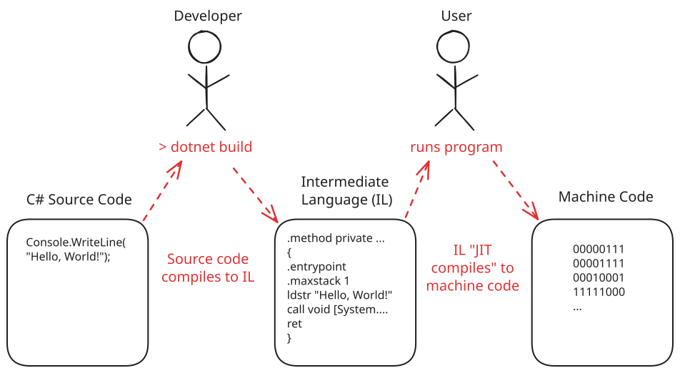

# Compiling

Software developers write source code in human-readable high level languages. The CPU cannot directly execute this code. It needs to first go through a process called **compilation**. This translates the source code into **machine code** that the CPU can execute.

## Compiled vs Interpreted

There are two main paradigms for compiling source code:

| Paradigm    | Description                                                                                                                        |
| ----------- | ---------------------------------------------------------------------------------------------------------------------------------- |
| Interpreted | The source code is translated into machine code one statement at a time at **runtime**. Types and memory are resolved dynamically. |
| Compiled    | The source code is translated into machine code **ahead of time**. Types and memory are resolved at compile time.                  |

Languages like Python are interpreted languages. In order to run Python code you install the Python interpreter on your machine, which serves as the means of translation.

Languages like C and C++ are compiled languages. In order to run code it must be compiled into machine code with a **compiler** program.

To put it simply, the computer can make more accurate assumptions about a compiled program than an interpreted program.

<!-- prettier-ignore -->
!!! info "Intermediate Language (IL) and Just In Time (JIT) Compilation"
    

    Some languages like Java and C# take a hybrid approach. These first compile to an **intermediate language (IL)** that isn't truly machine code. In other languages this is called **bytecode**.

    This intermediate code is then compiled to machine code at runtime by the .NET **runtime** through a process called **just in time (JIT) compilation**. JIT compilation is heavily used in modern programming languages, and blurs the line between the traditional categories of "interpreted" vs "compiled" languages.

    For now, it's enough that you understand that the code you write must be compiled ahead of time in order to be usable.

## Building in .NET

To build our project we simply run the `dotnet build` command. This will compile the project.

```bash
dotnet build
```
