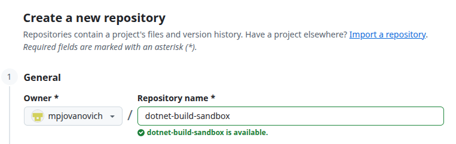

# Creating an Empty Project Shell

We have added some optional steps here if you plan to track your changes with Git. This is highly recommended, as it will:

- Ensure that you do not lose your work
- Allow you to track what changes were made to the codebase at what times
- Revert to a previous version of the code if needed
- Share your work with others

If you choose not to use Git, simply skip to the next page.

## Create a New Git Repository

Each project should have its own Git repository.



## Open your Terminal

After creating the repository, it exists on the **remote** server. To work on the project we need to **clone** it to our **local** machine.

Open up the **terminal** in your Operating System. The terminal is the text based interface used to run commands. This will be:

- _PowerShell_ or _Git Bash_ on Windows
- _Terminal_ on macOS (which runs _zsh_)
- _Terminal_ on Linux (which runs _bash_)

## Clone the Repository

Navigate to the parent directory of the project you want to create and run the `git clone` command. You must provide the URL of the repository to clone, which should be visible on page after creating the repository.

```bash
git clone <https://github.com/your-username/your-project-name.git>
```

<!-- prettier-ignore -->
!!! note "Cloning an Empty Repository"
    You will get a warning message about cloning an empty repository. This is expected and can be ignored.

## Open the Project in Visual Studio Code

Change into the project directory and open the project in Visual Studio Code.

```bash
cd your-project-name
code .
```
