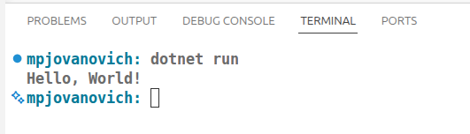

# Running the Program

## Using the `dotnet run` Command

To run the program use the `dotnet run` command in the terminal.

```bash
dotnet run
```

If the project is not already built, this will also build the project first; so you do not typically need to explicitly build the project before running it. We showed this in the previous section to make you aware of what the build system is doing.

You should now see the output of the program in the terminal underneath the command that you entered. This is where the `Console.WriteLine` statement is sending its output.



## Making our First Change

Let's make an adjustment to the `Program.cs` file. You're probably tired of seeing "Hello, World!" by now. Let's remove the comment on the first line and change the argument to the `Console.WriteLine` statement.

```csharp
Console.WriteLine("Stay excellent!");
```

Now run your program again using the `dotnet run` command in the terminal.

```bash
dotnet run
```

Your new output should appear in the terminal.

<!-- prettier-ignore -->
!!! tip "Clearing Terminal Output"
    Use the `clear` command to clear the terminal output between program builds and runs.
