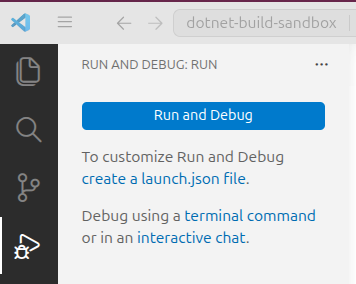
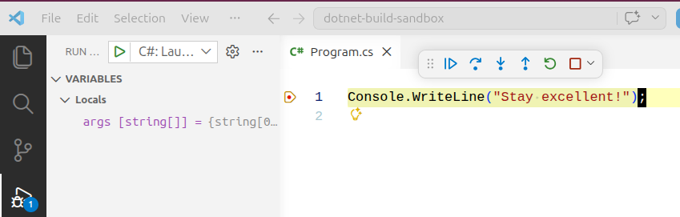

# Understanding the Debugger

## What is the Debugger?

The **debugger** is its own program that is **attached** to a running target program in order to track its state as it executes. This is one of the major advantages that an IDE offers over a simple text editor.

The debugger uses the debugging information from the `.pdb` files that were generated during the build process to map the compiled IL code to source code. As the IL code runs, the debugger acts as a "bridge" that can point to the corresponding source code line. The debugger also keeps track of values that are on the **call stack** - the methods that are currently being executed.

When we used the `dotnet run` command to run the program no debugger was attached. For quick changes, this is often sufficient. If we need to examine the program's runtime state in more detail, we can launch the program and then attach the debugger.

This is what the IDE does for you when you select the "Run and Debug" button from the "Run and Debug" pane or use the `F5` shortcut key.

The source code line that the breakpoint is set to is looked up using the debugging information, and when the compiled IL code reaches that line, the debugger will pause execution.

<!-- prettier-ignore -->
!!! warning "Know the Basics of Debugging"
    Going forward, we will assume that you know how to step through code using the VS Code debugger. If you are not familiar with debugging, please take an hour or so to learn the very basics.
