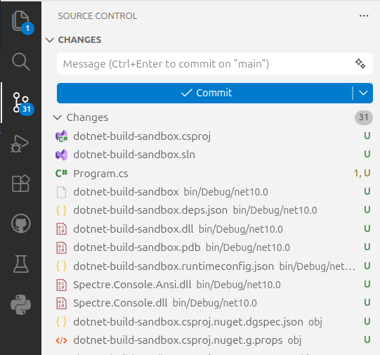
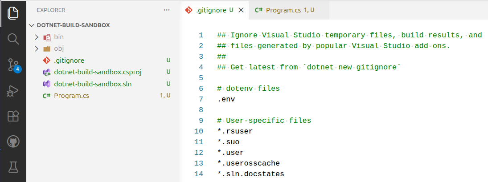

# What Belongs in Version Control?

Artifacts that can be rebuilt (e.g. `bin` and `obj` directories) should not be tracked in version control. The source code contains all of the information needed to build the application.

Unless we remove these unneeded files, the repository will quickly become cluttered.



The way to prevent this is to create a `.gitignore` file in the root of the repository. This file contains a list of files and directories that should not be tracked in version control. It can use patterns to match multiple files and directories at once.

In .NET, the easiest way to create a `.gitignore` with proper defaults is to use the terminal command:

```bash
dotnet new gitignore
```

Our `bin` and `obj` directories are now ghosted in the explorer pane, and the source control pane shows only four pending changes - one for each file that we want to track.



<!-- prettier-ignore -->
!!! info "Track your `.gitignore` file"
    Your `.gitignore` file does belong in version control. It contains valuable configuration information about what belongs with the application.

<!-- prettier-ignore -->
!!! success "Prove it to Yourself"
    Try deleting the `bin` and `obj` directories then rebuilding the application to see them come back. This will help you trust that these can safely be discarded without losing information.
