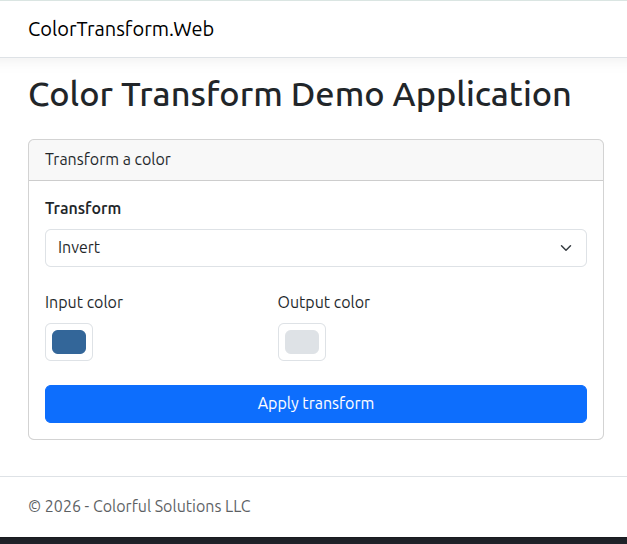
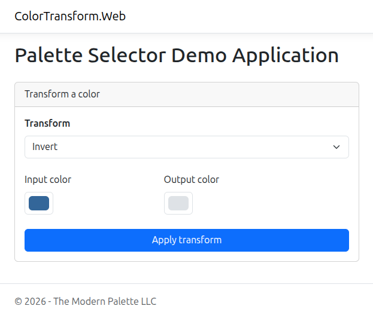

# Configuring an Application

## Running the Web Project

As a reminder, the web project can be run from the command line using the `dotnet run` command.

```bash
dotnet run --project src/ColorTransform.Web/ColorTransform.Web.csproj
```

This will start the web server. You can open the application in your web browser. To find the correct address, look at the output in the terminal. Here is a snippet showing that our application is running on `http://localhost:5156`.

```text
info: Microsoft.Hosting.Lifetime[14]
      Now listening on: http://localhost:5156
```

When you are ready to stop the application, press `Ctrl+C` in the terminal.

## Seeing the Application Settings in Action

You should now see the following in your browser:



The page title, first level header, and footer text are all set in the `appsettings.json` file:

_appsettings.json_

```json
{
  "App": {
    "Name": "Colorful Solutions LLC",
    "Title": "Color Transform Demo Application"
  }
  // Other settings...
}
```

_Index.cshtml.cs_

The code that renders the HTML for the page is in the `Index.cshtml.cs` file. This snippet shows that it is reading the Configuration values for the page title and app name, then using it in the first level header.

```csharp
@page
@inject IConfiguration Configuration
@model IndexModel
@{
    ViewData["Organization"] = Configuration["App:Organization"];
    ViewData["Title"] = Configuration["App:Title"];
    var hasOutput = !string.IsNullOrEmpty(Model.OutputColor);
}

<h1 class="mb-4">@ViewData["Title"]</h1>
```

We have not shown it here, the HTML title and page footer content are using these settings in the `_Layout.cshtml` file.

## Modifying the Application Settings

Let's modify the application settings to change the page title and app name.

```json
{
  "App": {
    "Organization": "The Modern Palette LLC",
    "Title": "Palette Selector Demo Application"
  }
}
```

The application reads the configuration values at startup, and will not watch them for changes. To see these changes you will need to restart the application by pressing `Ctrl+C` in the terminal and then running the `dotnet run` command from above again. After this, refresh the the page in your browser.

You should now see the following:



## When to Use Application Settings

In the above example, we assumed that we may deploy this application to multiple clients. If we had hardcoded the title and footer information, we would have needed to create a different file in the code for each client and maintain a separate codebase for each client. This would quickly become unmanageable.

If there is data that needs to change based on the _environment_ of the application, this data belongs in the application's configuration.
