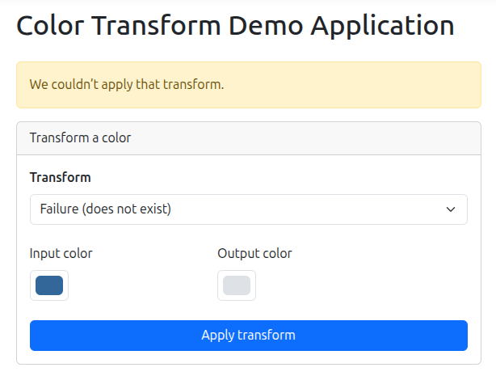
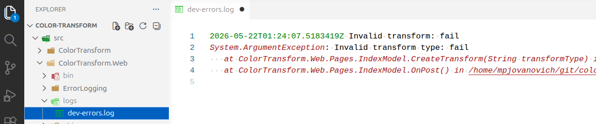

# Using Environment Settings

## Configuring settings for Each Environment Type

When you create a .NET project it will often create two configuration files: `appsettings.json` and `appsettings.Development.json`.

The `appsettings.json` file contains the application's base/default configuration. The `appsettings.Development.json` file contains overrides and settings that are specific to the development environment.

This is a common practice in other technologies as well. There may be several different environment-specific configuration files, each with their own values.

## Setting a Log File Path for Development

Our Color Transform application utilizes a development configuration file to control where the logging output for the application is written:

_application.json_

```json
{
  // ...
  "ErrorLogging": {
    "FilePath": "logs/errors.log"
  }
  // ...
}
```

_application.Development.json_

```json
{
  // ...
  "ErrorLogging": {
    "FilePath": "logs/dev-errors.log"
  }
  // ...
}
```

## Viewing the Error

We can create a logged error message by selecting the "Failure: does not exist" option from the dropdown menu, and clicking the "Apply transform" button. We will see the following error message:



We also get a detailed error message in the log file:



Note how the path to the log file is `logs/dev-errors.log`, which is the path specified in the development configuration file rather than the base configuration file. This is because the application is running in development mode.

<!-- prettier-ignore -->
!!! info "How to Configure the Runtime Environment"
    The .NET runtime uses a specific setting to determine which configuration file to use. This setting is called `ASPNETCORE_ENVIRONMENT`. If you want to see where this is actually set, you can open the `src/ColorTransform.Web/Properties/launchSettings.json` file.

## Exposing Error Information

Before moving on, it's worth noting a common best practice demonstrated in this code. Our catch block inside of `Index.cshtml.cs` looks like this:

```csharp
catch (ArgumentException ex)
{
    ErrorMessage = "We couldn’t apply that transform.";
    errorLog.Record($"Invalid transform: {TransformType}", ex);
}
```

The `ErrorMessage` property is what the user sees. The `errorLog.Record` method logs the error message to the log file.

Error messages help developers diagnose and fix issues, but can contain sensitive information that should not be exposed to the user. For this reason, a general, user-friendly message is shown in the application UI, while the actual exception details are written to the log file.

This gives the user a clear, readable error rather than a raw message they may not understand, while still preserving the full error details for developers.
