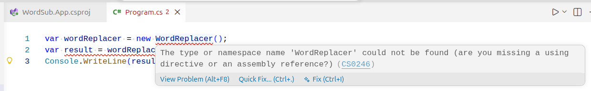

# Refactoring the a New Module

As the `WordReplacer` class and related logic increase in complexity, any refactor will become more difficult. Now that we have a the basic program working we are at a good point to migrate the new functionality into its own class library.

## Creating a Class Library

To create a class library, we create another folder under the root directory and run the following command:

```bash
# This assumes you are still in the WordSub.App subdirectory.
cd ..
mkdir WordSub
cd WordSub
dotnet new classlib
```

This will create a new directory with the same name as the class library, and a `Class1.cs` file. Rename this file to `WordReplacer.cs` and copy the contents of the contents of the original `WordReplacer.cs` file into it. Make sure to keep the namespace line in this file:

```csharp
namespace WordSub;

public class WordReplacer
{
    public string Replace(string text)
    {
        throw new NotImplementedException();
    }
}
```

After this, clean up by removing the original `WordReplacer.cs` file in the WordSub.App subdirectory:

```text
word-sub/
├── WordSub
│   ├── WordReplacer.cs
│   └── WordSub.csproj
└── WordSub.App
    ├── Program.cs
    └── WordSub.App.csproj
```

## Adding an Internal Project Reference

If you open the `Program.cs` file you will now see error squiggles:



The error text, "are you missing a using directive or an assembly reference?" reveals the issue. Now that we have moved the `WordReplacer` class to a new class library, we need to add a project reference to the `WordSub.App` project. The console application project does not currently have a way to access the code from the new project.

To add the reference navigate to the WordSub.App subdirectory and add the reference to the WordSub project:

```bash
cd ../WordSub.App
dotnet add reference ../WordSub/WordSub.csproj
```

We provide the path to the `csproj` file for the WordSub library when calling the `dotnet add reference` command. This adds a reference to the `csproj` file of the console application:

```xml
<ItemGroup>
  <ProjectReference Include="..\WordSub\WordSub.csproj" />
</ItemGroup>
```

## Adding a Using Directive

The error in `Program.cs` is still present. We have added the assembly reference from the original error message. We now need to add the using directive. Simply add the following line to the top of the file:

```csharp
using WordSub;
```

The squiggles should now be gone. We can run the program with the debugger, or with the `dotnet run` command while in the WordSub.App subdirectory, and we get the NotImplementedException error again.

The refactor is a success. We are now ready to implement the word replacement logic.
