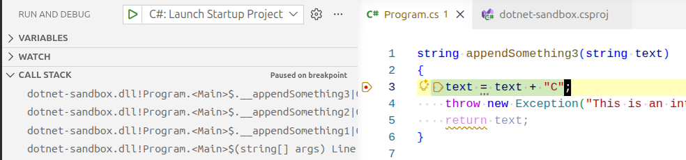

# The Stack Trace

## What is the Call Stack?

In any program except a simple script, functions call other functions within the application. Whenever one function calls another it adds a **stack frame** to the **call stack**.

When an error occurs, a program will often provide a **stack trace** so that developers can diagnose where the error occurred. In C# these are attached to the Exception object as a property that can be printed or logged.

Let's look at an example program that demonstrates how stack traces work.

## Setting up the Program

In the following example, execution of the program begins at the bottom, where `appendSomething1` is called and provided the string "START: ".

`appendSomething1` calls `appendSomething2`, which then calls `appendSomething3`.

```csharp
string appendSomething3(string text)
{
    text = text + "C";
    throw new Exception("This is an intentional exception to demonstrate stack trace.");
    return text;
}

string appendSomething2(string text)
{
    text = text + "B";
    text = appendSomething3(text);
    return text;
}

string appendSomething1(string text)
{
    text = text + "A";
    text = appendSomething2(text);
    return text;
}

try
{
    string result = "START: ";
    result = appendSomething1(result);
    Console.WriteLine(result);
}
catch (Exception ex)
{
    Console.WriteLine("An exception occurred: " + ex.Message);
    Console.WriteLine("Stack Trace: " + ex.StackTrace);
}
```

By the time we reach `appendSomething3`, the call stack looks like this:



<!-- prettier-ignore -->
!!! info "Viewing the Call Stack in VS Code"
    You can view the call stack in VS Code by opening the "Debug" panel and clicking the "Call Stack" tab.

    Try placing a breakpoint in `appendSomething3` and then clicking the "Debug" button, as shown in the screenshot.

## Printing the Stack Trace

The code contains an intentional exception to demonstrate stack trace.

Line 31 writes this stack trace to the console:

```text
at Program.<<Main>$>g__appendSomething3|0_0(String text) in /home/mpjovanovich/tmp/dotnet-sandbox/Program.cs:line 4
at Program.<<Main>$>g__appendSomething2|0_1(String text) in /home/mpjovanovich/tmp/dotnet-sandbox/Program.cs:line 11
at Program.<<Main>$>g__appendSomething1|0_2(String text) in /home/mpjovanovich/tmp/dotnet-sandbox/Program.cs:line 18
at Program.<Main>$(String[] args) in /home/mpjovanovich/tmp/dotnet-sandbox/Program.cs:line 25
```

## Interpreting a Line of the Stack Trace

When reading a stack trace, the first line is often the only one that we need. Here is how to read the first line.

`Program.<<Main>$>g__appendSomething3|0_0(String text)`
: The compiler-generated unique identifier for the local function, along with its method signature. The IL compiler adds prefixes and suffixes to encode the enclosing method and function index. We can tell that this came from our `appendSomething3` method.

`/home/mpjovanovich/tmp/dotnet-sandbox/Program.cs:line 4`
: Source file and line number.

Putting this all together, we can see that the error occurred in our `appendSomething3` method on line 4 of our `Program.cs` file - the intentional exception that was thrown.

## Interpreting the Full Stack Trace

The remaining lines in the stack trace are from the calls that led up to the error:

- Line 4 in `appendSomething3` was called from line 11 in `appendSomething2`
- Line 11 in `appendSomething2` was called from line 18 in `appendSomething1`
- Line 18 in `appendSomething1` was called from line 25 in `Main` (the autogenerated top-level function)

While the full call stack was not necessary to diagnose the error in this case, in a large program the function may be called in many places. The full call stack is useful to tell us the path that the program took to get to the error - from start to finish.

## Why is the Stack Trace Useful?

When you are running a test harness, you can simply set the IDE to break on exceptions and see for yourself where the error occurred.

In a live production system, you will only have access to whatever information is logged in the event of a program failure. The stack trace can give you important clues about what part of your program is failing, and how it reached that point.
