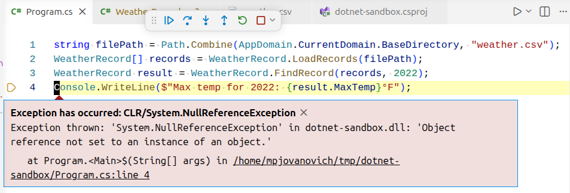
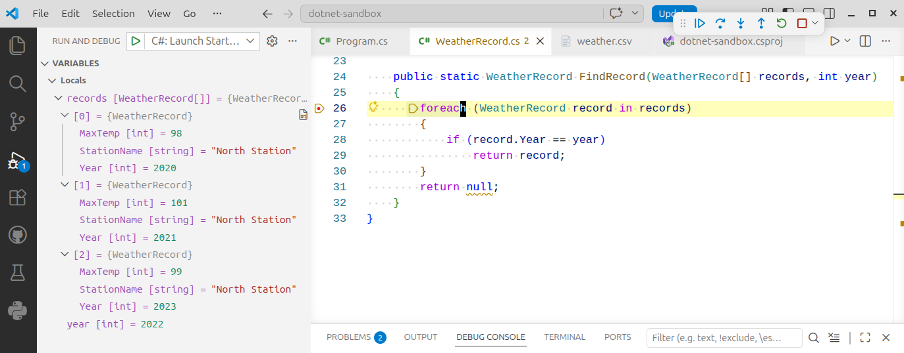
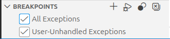

# Test Harnesses

## Why Use a Test Harness?

To reproduce a runtime error, we need to create a **test harness** that can control the environment and reproduce the error. This can be as simple as a console application that can be run from the command line, or a more complex web application that can be deployed to a test environment.

The primary goal of a test harness is to exactly match the environment with the error:

- Same versions of code and dependencies
- Same configuration values
- Same input data

You might also think of a test harness as a "developer sandbox" that allows us to flexibly run scenarios against the application for both new development and troubleshooting.

## Creating a Test Harness

Let's run an example program with three files. Try following along by creating a new console application. If you need a reminder on how to do this, refer to the [Creating a .NET Project](../builds/creating-dotnet-project.md) page.

Create the three files below in the root directory of the project.

_weather.csv_

CSV data with yearly average temperatures for a weather station. Our example is very small, but these types of data failes can have thousands of rows, making it impossible to manually scan the data for discrepancies.

Let's assume the client is reporting a runtime error when they load this file and try to find the record for 2022. We need to figure out why.

```csv
2020,North Station,98
2021,North Station,101
2023,North Station,99
```

_WeatherRecord.cs_

A class to represent a weather record, along with some helper methods to load records into an array and find records from the array.

Don't worry about the details of the class for now. We just need to know how to find the runtime error that will appear in this class.

```csharp
public class WeatherRecord
{
    public int Year { get; set; }
    public string StationName { get; set; }
    public int MaxTemp { get; set; }

    public static WeatherRecord[] LoadRecords(string filePath)
    {
        string[] lines = File.ReadAllLines(filePath);
        WeatherRecord[] records = new WeatherRecord[lines.Length];
        for (int i = 0; i < lines.Length; i++)
        {
            string[] parts = lines[i].Split(',');
            records[i] = new WeatherRecord
            {
                Year = int.Parse(parts[0]),
                StationName = parts[1],
                MaxTemp = int.Parse(parts[2])
            };
        }
        return records;
    }

    public static WeatherRecord FindRecord(WeatherRecord[] records, int year)
    {
        foreach (WeatherRecord record in records)
        {
            if (record.Year == year)
                return record;
        }
        return null;
    }
}
```

_Program.cs_

The test harness for the program.

This is what we will use to rig up a reproducable runtime error based on the file that the client has provided.

```csharp
// Point to the csv file that the client has provided.
string filePath = Path.Combine(AppDomain.CurrentDomain.BaseDirectory, "weather.csv");

// Load the records from the file.
WeatherRecord[] records = WeatherRecord.LoadRecords(filePath);

// Find the record for 2022.
WeatherRecord result = WeatherRecord.FindRecord(records, 2022);

// Write the result to the console.
Console.WriteLine($"Max temp for 2022: {result.MaxTemp}°F");
```

<!-- prettier-ignore -->
!!! check "Include the CSV File in the Project Output"
    In order to get this example to work, you need to include the CSV file in the project output. In VS Code, add this to your `.csproj` file within the Project section:

    ```xml
    <ItemGroup>
      <Content Include="weather.csv">
        <CopyToOutputDirectory>PreserveNewest</CopyToOutputDirectory>
      </Content>
    </ItemGroup>
    ```

## Viewing the Runtime Error

When we run the program through the debugger, we will see the following output:



We see a NullReferenceException, which means that the program tried to access an object that is null. At this point we don't know why yet. Let's now put a breakpoint in the `FindRecord` method so that we can examine what records the program contains.



There are three records in the array for the years 2020, 2021, and 2023. The record for 2022 is not in the array. The CSV file itself did not provide the necessary information.

Our `Program.cs` file provided a short snippet of code that reproduced what the client was experiencing, and we can now confirm the source of the bug.

<!-- prettier-ignore -->
!!! check "Check Your Exception Settings"
    Most IDEs offer a way to configure which types of exceptions are caught by the debugger. By default, VS Code will only break on unhandled exceptions, that are not wrapped in a `try`/`catch` block.

    If you want to break on all exceptions, open the "Run and Debug" menu and make sure that "All Exceptions" is checked under the "Breakpoints" submenu.

    

## Fixing the Bug

From this point, the fix becomes a matter of communicating intent. As the library author we can inform the client that the code is working as intended. If we do this, it is their responsibility as the library consumer (the ones using our code) to add a check on their end to ensure that their data is valid and handle the possible null value returned by our code.

Alternatively, we can add error checking to either ensure that all years are present in the given range or to throw an exception if the year that is searched for is not found.
