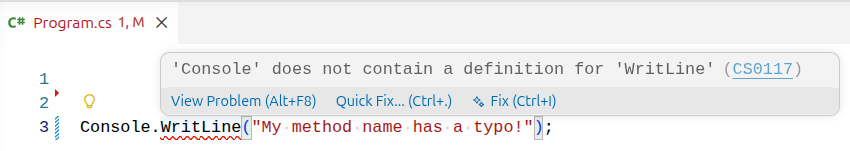
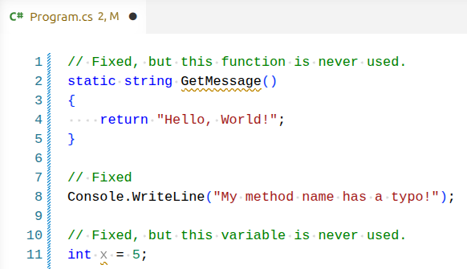

# Troubleshooting a Failed Build

## Viewing Compile-Time Errors

When using an IDE such as VS Code, you will often (but not always) see visual indicators of compile-time errors in the form of green and red squiggles under the code.



You can hover over the squiggle to see the error message details. Often times this is a quick fix, such as a syntax error or name typo.

If we try to build the project with the error from above in place, we will see the same error appear in the build output. Try running the snippet with the typo and check your terminal output to see the error.

```bash
mpjovanovich: dotnet build
Restore complete (0.4s)
  dotnet-build-sandbox net10.0 failed with 1 error(s) (0.2s)
    /home/mpjovanovich/tmp/dotnet-build-sandbox/Program.cs(3,9): error CS0117: 'Console' does not contain a definition for 'WritLine'

Build failed with 1 error(s) in 0.7s
```

## Interpreting Build Output

Let's pick this output apart piece by piece.

```bash
mpjovanovich: dotnet build
```

The command that was run.

```bash
Restore complete (0.4s)
```

The .NET Build tool telling us that it automatically ran a restore operation prior to the build.

```bash
  dotnet-build-sandbox net10.0 failed with 1 error(s) (0.2s)
```

The project name, the version of the .NET SDK we are using, the number of errors that occurred, and the time to compile.

```bash
    /home/mpjovanovich/tmp/dotnet-build-sandbox/Program.cs(3,9): error CS0117: 'Console' does not contain a definition for 'WritLine'
```

The path to the file that contains the error, the line number and character offset of the error, and the error message.

```bash
Build failed with 1 error(s) in 0.7s
```

A summary message about the state of the build.

## Diagnosing Compile-Time Errors

Of the above information, we are most interested in the error message for our single error. The error message line tells us the following:

- The file that has the error is `Program.cs`.
- The error is on line 3, character 9.
- The error message is `'Console' does not contain a definition for 'WritLine'`.

Reading the error message tells us exactly where to look for the error, so that we can quickly pull up the relevant code. We don't need to scan the entire codebase.

<!-- prettier-ignore -->
!!! warning "Line Numbers and Character Offsets"
    The reported line numbers and character offsets may not exactly match what is in the source code. Compilers sometimes remove parts of the code during the compilation process. If you see a line number reported as an error but that code looks correct, check the lines nearby.

## Fixing Compile-Time Errors

Let's modify `Program.cs` to introduce multiple errors.

```csharp linenums="1"
// We're not allowed to use private here.
private static string GetMessage()
{
    return "Hello, World!";
}

// This line has a typo
Console.WritLine("My method name has a typo!");

// No semicolon
int x = 5
```

We get the following build output:

```bash
mpjovanovich: dotnet build
Restore complete (0.4s)
  dotnet-build-sandbox net10.0 failed with 2 error(s) (0.1s)
    /home/mpjovanovich/tmp/dotnet-build-sandbox/Program.cs(2,1): error CS0106: The modifier 'private' is not valid for this item
    /home/mpjovanovich/tmp/dotnet-build-sandbox/Program.cs(11,10): error CS1002: ; expected

Build failed with 2 error(s) in 0.7s
```

Our source code actually has three errors, but the output only reports two! Sometimes one build error will mask another. The best strategy to address this case is to fix the errors one at a time, and rebuild after each fix.

The steps to resolve our errors are: first remove the `private` modifier from the `GetMessage` method and rebuild. Then add the missing semicolon and rebuild again. Only then will we see the third error message regarding the `Console.WritLine` method call typo.

## Build Warnings

Even after fixing the above errors, I see two "green squiggles" in the IDE, and the build output shows the following warnings:



```bash
mpjovanovich: dotnet build
Restore complete (0.4s)
  dotnet-build-sandbox net10.0 succeeded with 2 warning(s) (0.3s) → bin/Debug/net10.0/dotnet-build-sandbox.dll
    /home/mpjovanovich/tmp/dotnet-build-sandbox/Program.cs(11,5): warning CS0219: The variable 'x' is assigned but its value is never used
    /home/mpjovanovich/tmp/dotnet-build-sandbox/Program.cs(2,15): warning CS8321: The local function 'GetMessage' is declared but never used

Build succeeded with 2 warning(s) in 0.9s
```

**Build warnings** indicate that the code will compile correctly, but there are potential issues that should be addressed.

In this case the warnings tell us that we have code that is not being used anywhere in the application. This may indicate that there is a logic bug from something we intended to use but forgot to call, and it also leaves a distracting mess for anyone working with the codebase.

Warnings are okay during active development, but should be addressed prior to committing and pushing code to a repository.
