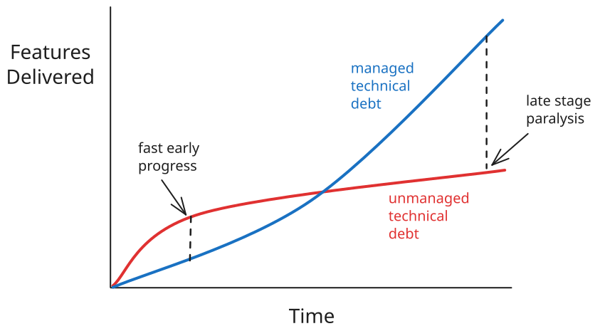

# Example

This page shows how markdown will render.

## H2 Header

This is h2 content.

### H3 Header

This is h3 content.e

#### H4 Header

This is h4 content.

---

| Column 1 | Column 2 | Column 3 |
| -------- | -------- | -------- |
| Cell 1   | Cell 2   | Cell 3   |
| Cell 4   | Cell 5   | Cell 6   |
| Cell 7   | Cell 8   | Cell 9   |

---

{ width="600" class="center" }

---

How to do asides:

<!-- prettier-ignore -->
!!! note "Optional custom title"
    Aside text here. Indented 4 spaces.

    Add line feed between paragraphs

Available icons:

| Type       | Aliases                | Color      | Icon           |
| ---------- | ---------------------- | ---------- | -------------- |
| `note`     |                        | blue       | pencil         |
| `abstract` | `summary`, `tldr`      | light blue | clipboard      |
| `info`     | `todo`                 | teal       | info circle    |
| `tip`      | `hint`, `important`    | green      | fire           |
| `success`  | `check`, `done`        | green      | checkmark      |
| `question` | `help`, `faq`          | green      | question mark  |
| `warning`  | `caution`, `attention` | orange     | triangle       |
| `failure`  | `fail`, `missing`      | red        | X              |
| `danger`   | `error`                | red        | lightning bolt |
| `bug`      |                        | red        | bug            |
| `example`  |                        | purple     | list           |
| `quote`    | `cite`                 | grey       | quote marks    |
