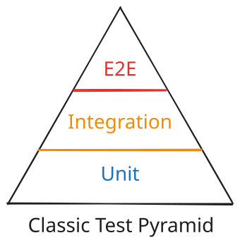

# Balancing Test Efforts

Now that we've seen three major types of tests, we will close this section on some guidance on when to use each.

## The Test Pyramid

The prevailing wisdom for a long time was to follow the "test pyramid". This was a guideline that suggested that most tests should be unit tests, with a smaller number of integration tests, and a very small number of end-to-end tests.

{ width="300" }

The test pyramid was based on the idea that the cost of testing increases as you move up the pyramid. Unit tests are the cheapest to write and run, and end-to-end tests are the most expensive.

With the advent of technologies like efficient test frameworks and containerization, the cost of running tests has decreased significantly. This has made it possible to automate full integration and end-to-end test suites on a build server as part of each build process.

Because of this, many leading developers advocate for a more nuanced testing approach.

## A Modern Approach

Rather than applying rigid constraints about test coverage, it is better to look at where tests provide the most value:

- **Unit tests**: excellent for verifying code that is complex or critical to the application's behavior.
- **Integration tests**: useful for verifying correct communication between components and related dependencies.
- **End-to-end tests**: useful for verifying full user workflows in a test environment that closely mimics production.

Different types of applications require different testing profiles. A text parsing library may only require unit tests. What matters most for a library is that the exposed public API is correct.

A "CRUD" web application with very simple domain logic may have mostly end-to-end tests. These applications often involve a many orchestration steps to rig all of the components together, so tests should focus on making sure this has been done correctly. Even one end-to-end test that models a "golden path" user journey - a typical workflow that a user takes through the application - can go a long way towards detecting issues before an application is released.
