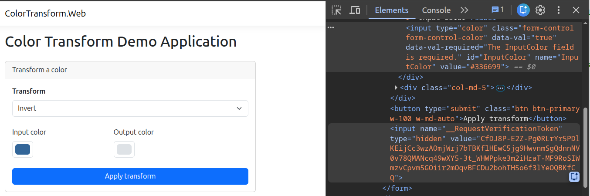
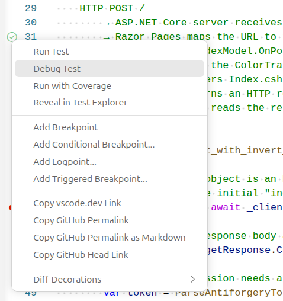
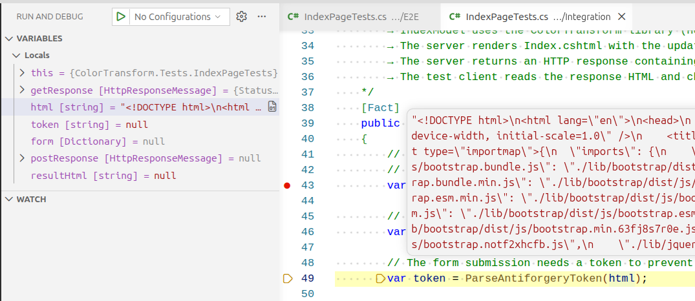
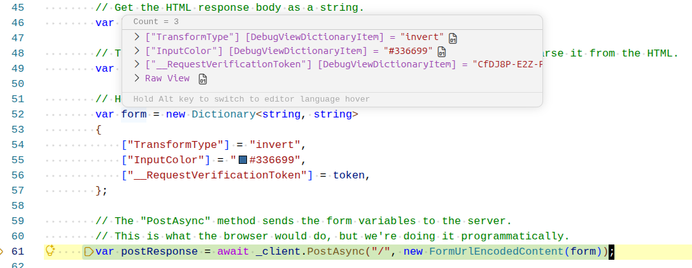
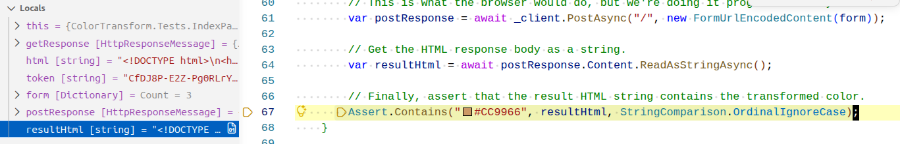
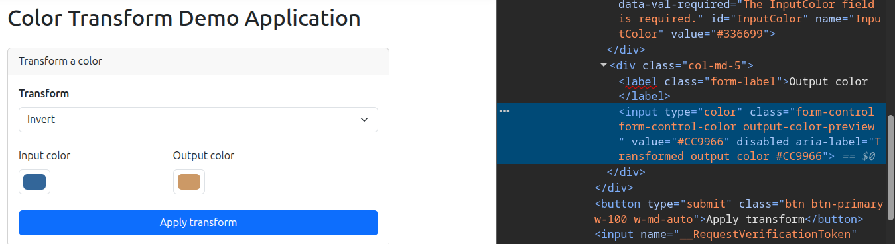

# Integration Testing

## What is Integration Testing?

**Integration testing** is the process of testing the interaction between two or more **components** of the application.

A component may refer to anything from a single class to a whole subsystem of the application (several modules), and there is no hard line between test types.

## Integration Testing by Example

In this example we will see how multiple components in the reference project work together. The components come from both the Web project (Razor Pages) and the Library project (the core Color Transform Library).

If you do not have experience debugging applications that make HTTP requests, this is a great opportunity to follow along and learn the process. Anyone working with web technologies will undoubtedly need to rig up a test server at some point.

Let's look at the web application again before we dig into the code. This shows the index page of the application, and a snippet of html from the rendered page. We will reference this screenshot later:



<!-- prettier-ignore -->
!!! info "Viewing Rendered HTML"
    You can view the rendered HTML of a page in one of two ways:

    1. Right click on the page in the browser and select "View Source".
    2. Open the browser developer tools and view the "Elements" tab. This is usually bound to the `F12` shortcut key, but you may also find this option in the browser menu.

### Viewing the Test Code

For this example we will look at the `tests/ColorTransform.Tests/Integration/IndexPageTests.cs` file. This file contains a single integration test for the `Index` page of the web application.

There's a lot of code to unpack here, so let's break it down step by step. Only a snippet is shown here, but you can access the rest of the full version [here](https://github.com/software-resilience-reliability-book/color-transform/blob/main/tests/ColorTransform.Tests/Integration/IndexPageTests.cs) :

```csharp
[Fact]
public async Task post_with_invert_returns_transformed_color_string_in_returned_html()
{
    // The "_client" object is an HttpClient that can be used to send HTTP requests to the test server.
    // Here we get the initial "index" page from the in-memory test server.
    var getResponse = await _client.GetAsync("/");

    // Get the HTML response body as a string.
    var html = await getResponse.Content.ReadAsStringAsync();

    // The form submission needs a token to prevent CSRF attacks, so we parse it from the HTML.
    var token = ParseAntiforgeryToken(html);

    // Here we assemble the form variables for submission.
    var form = new Dictionary<string, string>
    {
        ["TransformType"] = "invert",
        ["InputColor"] = "#336699",
        ["__RequestVerificationToken"] = token,
    };

    // The "PostAsync" method sends the form variables to the server.
    // This is what the browser would do, but we're doing it programmatically.
    var postResponse = await _client.PostAsync("/", new FormUrlEncodedContent(form));

    // Get the HTML response body as a string.
    var resultHtml = await postResponse.Content.ReadAsStringAsync();

    // Finally, assert that the result HTML string contains the transformed color.
    Assert.Contains("#CC9966", resultHtml, StringComparison.OrdinalIgnoreCase);
}
```

Take a moment to read through the code comments before moving on to the next section.

The test code starts up a web server in-memory on your local machine, and runs the web application inside of it. We can use this in-memory server to make "fake" HTTP requests to the web application and confirm results that are returned. This simulates what is happening when the live web server is running and the user actually submits the main form.

<!-- prettier-ignore -->
!!! info "Review of Web Forms"
    If you have not studied web forms in depth, that's okay. When you submit a web form, the `Input` HTML elements, which correspond to the form fields, are collected and sent to the web server. It then uses those values to do work on the back end and form a correct response.

    In our case, the Index page needs to know the input color, which transform we want from the dropdown, and an extra value that's hidden from view in the HTML form that is used to prevent CSRF attacks. If you look at the rendered page HTML after runnin the web application, you will see all of these values in the form as `Input` elements, including the hidden CSRF token:

    ```html
    <input name="__RequestVerificationToken" type="hidden" value="CfDJ8P-E2Z-Pg0RLrYr5PDlKEihSM_3W1BTSVKIcAD3CI08x3RsiXORxaYAKP1TnqcOEsHFnTXpwVPhqWUyoVm6sulyGtPDIZeRHBPQFzDAWxs7zEzj8vfUhqW1YROULIC6NiTePMIeAq9gx7WDVXEB26IQ" />
    ```

### Stepping through the Test

In VS Code, set a breakpoint on the line with:

```csharp
var getResponse = await _client.GetAsync("/");
```

Then right click on the green bubble in the margin near the test name and select "Debug Test". This will allow the breakpoint to be hit. Simply running the tests with the "Run Test" or the 'dotnet test' command will not rig the program up to the debugger.



After the breakpoint is hit, use the "Step Over" command in the debugger control panel to move forward a couple of lines.

You will see that the code did in fact receive an HTTP response from the in-memory server. The HTML from this response is shown in the "html" variable.



After a few more lines, the token has been extracted from this HTML, and the form variables have been assembled into a Dictionary. They are ready to be sent to the server using an HTTP POST request.



We get another HTTP response back from the server and convert the result HTML into a string.

After this we are finally ready for our "Assert" step. If you examine the `resultHtml` string you will see that it contains the hex value of the transformed color.



This matches the same expected output color that we would get if we ran the application ourselves, and clicked the "Apply transform" button.



## Value of Integration Testing

The test that we walked through confirmed that all of the components involved in the test worked together to produce the expected HTML value. If any component along the way had failed, the final assertion would have failed.

It is very possible to have working unit tests for each component, but to find that the system does not work as intended once these components are integrated. Imagine if we changed the method signature on one of the functions in the color library, or decided to throw a new type of exception.

Integration testing tests communication and coordination between components. It makes sure that the contracts between a unit and its consumers, those parts of the system that interface with it, remain unbroken.
