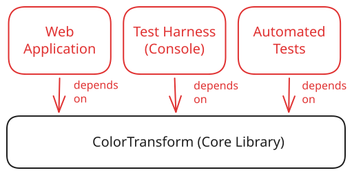

# Enforcing Direction of Dependencies

... direction of dependencies ...

... current project looks like this. note that library reference represents core functionality that does not depend on any other projects.

{ width="400" }

... suppose we wanted to add a mobile app as a second front-end option for our users. We could simply point it at the same library.

<!-- TODO: diagram showing public API of library, kind of like a class diagram? Is there one for this? May have to make custom -->
