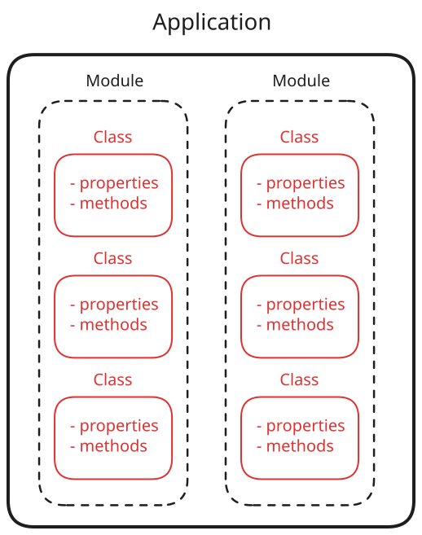

# Project Refactoring

After functions and classes, the next logical boundary for grouping code is by **module**.

{ width="450" }

A software application is rarely bundled into a single unit of code. Instead, it is composed of multiple modules that are each responsible for a specific part of the application's overall functionality.

In this chapter we will

<!-- prettier-ignore -->
!!! info "Terminology Note"
    "Module" is used here as the ecosystem-neutral name for the bundled unit of code. Different ecosystems have different terminology for this idea: .NET calls it an **assembly**, Go and Python a **package**; you might also hear **library** used informally.
