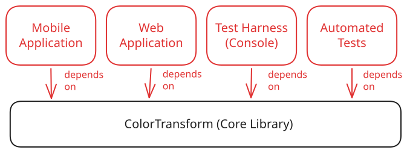
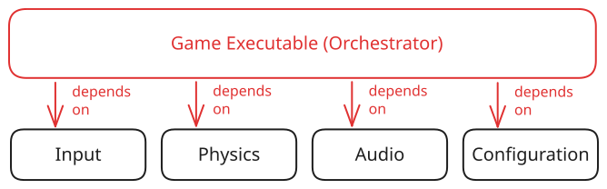

# Managing Direction of Dependencies

Aside from isolating functionality into logical independent units, modularity within an application can also help to enforce the direction of dependencies between modules.

Just as a function has a caller, a module has a consumer. Lower level "core" libraries are used by higher level "executive" libraries, which often form the executable - the entry point to the application.

## Sharing a Dependency

The `ColorTransform` module from the reference project contains core functionality that does not depend on any other modules.

{ width="450" }

This frees it to be reused by several consumers:

| Consumer        | Description                                                          |
| --------------- | -------------------------------------------------------------------- |
| Web Application | The user-facing application that allows users to transform colors.   |
| Test Harness    | The console application that allows developers to debug the library. |
| Test Suite      | The automated test unit tests project.                               |

Suppose we wanted to add a mobile app as another option for users to interface with the color transform library. We could simply point it at the `ColorTransform` library that contains the core "logic" of the application.

{ width="620" }

The new mobile application front-end project would not have to have any knowledge of other consumers; it could even be developed independently by a different team.

This pattern of orienting dependencies is present in several application architectures, such as Hexagonal Architecture (Ports and Adapters) and Clean Architecture. What is common to these is that the core functionality of an application is kept as free of dependencies as possible, leaving its consumers to reference it.

<!-- prettier-ignore -->
!!! info "Complex Dependency Graphs"
    The examples above show shallow graphs for clarity, but real applications commonly have chains of dependencies — module A depends on module B, which depends on module C, and so on. This is normal and expected.

    What matters is that the direction of dependencies remains consistent: consumers depend on the core, never the reverse.

## Orchestrating Many Dependencies

In a well-structured project, low-level foundational modules don't need to know about each other. The API of these modules is not meant for other modules within the same layer. A higher-level module consumes them and coordinates their behavior.

Consider the game library from the previous section:

{ width="650" }

The core functionality, the "logic" of the application, is contained in multiple libraries. We have only showed a few here. The entry point to the application is a project that depends on all of these libraries.

This project is responsible for coordinating their activity, and managing their input and output. Setting the application up this way removes the need for the lower level libraries to communicate (depend on) each other. The orchestrating module "supervises" the program's execution by calling each module in turn and passing only the information that each needs to know to perform its task.
