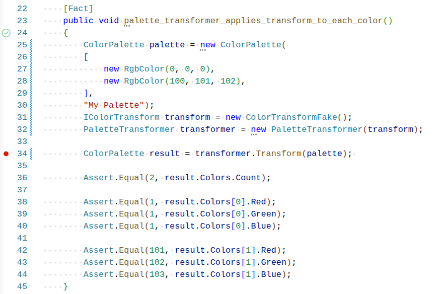

# Controlling the Test Environment

## Why use Interfaces in Tests?

The use of interfaces is by no means specific to tests; however interfaces are used frequently in unit tests because they allow us to:

- Make test output predictable and deterministic by supplying controlled inputs
- Provide simplified versions of test dependencies that otherwise would be complex or costly to create

## Faking a ColorTransform

The `PaletteTransformerTests` class provides an example of how we can use interfaces to our advantage when writing tests.

```csharp
/*
    This class is here to decouple the actual transform from the test rather than
    tie it to any one implementation. For example: we could have used "InvertTransform"
    instead of "ColorTransformFake", but then these tests all count on the invert transform
    working correctly, and tests are not isolated to the system under test (PaletteTransformer).
*/
class ColorTransformFake : IColorTransform
{
    public RgbColor Apply(RgbColor color)
    {
        return new RgbColor(color.Red + 1, color.Green + 1, color.Blue + 1);
    }
}

[Fact]
public void palette_transformer_applies_transform_to_each_color()
{
    ColorPalette palette = new ColorPalette(
    [
        new RgbColor(0, 0, 0),
        new RgbColor(100, 101, 102),
    ],
    "My Palette");
    IColorTransform transform = new ColorTransformFake();
    PaletteTransformer transformer = new PaletteTransformer(transform);

    ColorPalette result = transformer.Transform(palette);

    Assert.Equal(2, result.Colors.Count);

    Assert.Equal(1, result.Colors[0].Red);
    Assert.Equal(1, result.Colors[0].Green);
    Assert.Equal(1, result.Colors[0].Blue);

    Assert.Equal(101, result.Colors[1].Red);
    Assert.Equal(102, result.Colors[1].Green);
    Assert.Equal(103, result.Colors[1].Blue);
}
```

## Walking through the Test

In this test we want to make sure that each color that was provided to the `PaletteTransformer` was transformed correctly. Let's walk through the Arrange-Act-Assert pattern:

### 1. Arrange

First, the `palette` is created with two colors: one black and another with RGB values of 100, 101, and 102. It doesn't matter which colors were chosen; we are only using them to verify that the transform was applied correctly.

Next a `ColorTransformFake` instance is created. This is a fake implementation of the `IColorTransform` interface that simply adds 1 to the RGB values of the color.

Because the `ColorTransformFake` class implements the `IColorTransform` interface, it can be provided as the constructor argument for a `PaletteTransformer` instance, which we have done on the next line.

### 2. Act

The "Act" step is to call the `Transform` method on the `PaletteTransformer` instance, passing in the `palette` instance.

### 3. Assert

We make several assertions in this test, but they all relate to the behavior that we want to verify:

- The `Transform` method returns a `ColorPalette` instance with two colors. It didn't leave any out or add extras.
- The first color has RGB values of 1, 1, 1. This is the result of the `ColorTransformFake` instance adding 1 to the RGB values of the first color.
- The second color has RGB values of 101, 102, 103. This is the result of the `ColorTransformFake` instance adding 1 to the RGB values of the second color.

## Stepping through the Test in VS Code

It can be especially challenging to figure out how all of the moving parts in a program fit together when you are first learning new concepts. The debugger is a valuable tool to help you understand what the program is doing.

Try setting a breakpoint in the test and using the "Step Into" command to step through the code. The source file is `tests/ColorTransform.Tests/PaletteTransformerTests.cs`:



Then right click on the green checkmark next to the function name and select "Debug Test". From here you can use the "Step Into" command to step through the `Transform` method on `ColorPalette` and see how its copy of the `ColorTransformFake` instance is used to transform each of the colors that were provided.

## Why Use a Fake Implementation?

Since we already have other implementations of the `IColorTransform` interface, for example `GrayscaleTransform`, why not just use one of these in the test?

If we were to use one of these implementations we would couple the test to the implementation of the transform itself. What would happen if we changed the details of how `GrayscaleTransform` works? We might, for example, change the formula for a lighter or darker shade of gray. This would break the test, because the test is expecting a different result.

The `PaletteTransformer` class is not supposed to know anything about which transform was provided to it. By using a fake implementation we are able to **decouple** the test from its dependencies, and isolate the behavior of the system under test (the `PaletteTransformer` class).

Using a fake implementation of a dependency gives us predictable results, and is another way to control the environment in which the test is run.
