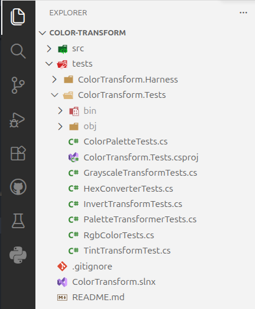

# Using the Reference Project

## Making Your Own Copy

The main application that we will work with over the course of this book is a color transformation library. A **library** is a bundled unit of code that has no startup application, but can be used by other applications. Because there is no startup application, we need to create a test harness to run the library and see it in action.

This project contains the unit tests that we will reference in this chapter, as well as code that we will use later in the book.

<!-- prettier-ignore -->
!!! info "Additional Instructions"
    If you have not already done so, make sure to download the [Color Transform Application](https://github.com/software-resilience-reliability-book/color-transform) reference project so that you can follow along. This project has been marked as a template, so you can make your own copy of the project and modify it as you see fit.

    For additional instructions on using the reference project, see the [reference project](../reference-project.md) page.

## Running the Tests

In a C# project that contains tests, the tests can be run from the command line using the `dotnet test` command:

```bash
dotnet test
```

This command will automatically build the project, then discover and run the tests. You should see output like the following:

```text
mpjovanovich: dotnet test
Restore complete (2.4s)
  ColorTransform net10.0 succeeded (4.3s) → src/ColorTransform/bin/Debug/net10.0/ColorTransform.dll
  ColorTransform.Tests net10.0 succeeded (0.8s) → tests/ColorTransform.Tests/bin/Debug/net10.0/ColorTransform.Tests.dll
[xUnit.net 00:00:00.00] xUnit.net VSTest Adapter v3.1.4+50e68bbb8b (64-bit .NET 10.0.7)
[xUnit.net 00:00:00.07]   Discovering: ColorTransform.Tests
[xUnit.net 00:00:00.14]   Discovered:  ColorTransform.Tests
[xUnit.net 00:00:00.17]   Starting:    ColorTransform.Tests
[xUnit.net 00:00:00.28]   Finished:    ColorTransform.Tests
  ColorTransform.Tests test net10.0 succeeded (1.1s)

Test summary: total: 31, failed: 0, succeeded: 31, skipped: 0, duration: 1.1s
Build succeeded in 9.2s
```

The tests run very quickly. This is by design. Unlike other more comprehensive types of testing, unit tests must be extremely fast. This allows developers to run the tests over and over, every time a change is made to the code.

Most of the time listed in the above output (9.2s) was actually spent building the project. Try running the tests again. You should see a much shorter duration, typically less than 2 seconds.

## Locating the Tests

The tests are located in their own project, in the `tests/ColorTransform.Tests` directory.



## Testing Frameworks

Depending on what technology you are working with, there may be multiple **testing frameworks** to choose from. xUnit is a popular **testing framework** for C#. Others that you might hear about include the Jest framework for JavaScript or the pytest framework for Python.

These frameworks provide a common interface for writing tests, so that you don't have to write your own test runner from scratch.

## xUnit Conventions

The basic conventions for writing tests in xUnit are as follows:

- Tests are located in their own project, typically in the `tests` directory.
- Test suites are organized into classes, which should be prepended or appended with the word "Test" or "Tests".
- Test methods are public methods that are decorated with the `[Fact]` attribute.

A typical test class might look like the following:

```csharp
public class HexConverterTests
{
    [Fact]
    public void hex_string_creates_rgb_color_when_valid()
    {
        var converter = new HexConverter();

        var color = converter.FromHexString("#FF5511");

        Assert.Equal(255, color.Red);
        Assert.Equal(85, color.Green);
        Assert.Equal(17, color.Blue);
    }
    // ... additional tests here ...
}
```
